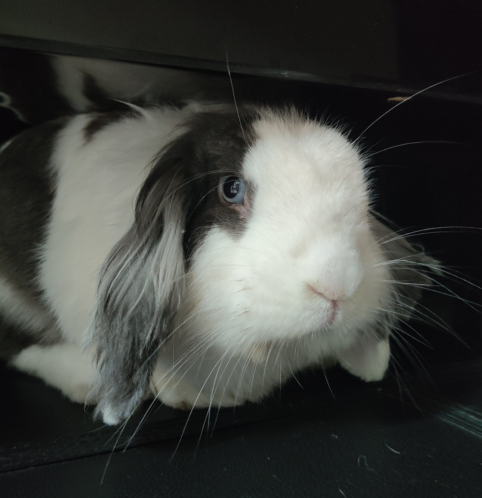

# 假如时间能够倒退该多好
## 仅以此来纪念我最爱的小宝贝

### 不期而遇的幸福

虽然从小就喜欢小动物，但是30岁了还没有拥有过自己的宠物。因为我的内心充满了矛盾，我喜欢他们的可爱单纯，看到他们无邪的笑容我的心都化了。可是我又不想承担主人的责任，我也没有信心能够当好一个合格的主人，而且小动物的寿命都有限，我不愿面对这种预期可见的分离。曾经捡到过2只小狗，都因为这些原因送给了别人。因此当我老婆一次又一次说要买宠物的时候我很抗拒，我不想当一个玩玩而已的主人。

直到有一天，她把你带回了家，我一下就喜欢上了你。我从来没有见过像你这么可爱的兔子，你的眼睛像蓝宝石一样漂亮，透着狡黠的目光；你的耳朵就像小飞象一样，我最喜欢撸你的耳朵了；你的小鼻子一耸一耸的让我很是惊奇，后来才知道那是你舒服的表现；你三瓣嘴是那么的可爱，吧唧吧唧地吃什么都香，看你吃东西是我最解压的时候。从那一天起，你就是我最喜欢的小宝贝。

你有一点笨，教你上厕所不知道教了多久，第一次发现你会上厕所了，我是多么的欣喜。你很聪明，好吃的藏在哪里你都找的到。你好调皮，你喜欢追着我的扫帚不让我扫地，家里的线材不知道被你咬坏多少。你好乖，你会静静地坐在我旁边让我抚摸你的头。你一点都不亲人，从你来家里没有让我抱过一次。你好亲人，我走到哪里你就跟到哪里，一不小心就要被你拌摔跤。你的胆子好小，想把你抱出笼子的时候你一个劲往后退。你的胆子好大，是天生的冒险家，为了找吃的居然爬到了钢琴顶上，我是又惊又好笑，生怕你摔坏了。想起我们一起走过的点点滴滴，我的心里都是甜蜜，你给一个30岁的男人的枯燥生活增添了缤纷的色彩。

你刚来的时候，我还在家工作，我们朝夕相处。我工作一会就要看一下你，看你跑，看你跳，看你趴在角落里睡觉。最喜欢你的松弛感，你走着走着就四脚一蹬，扑通一声摔倒在地板上，你张开脚趴在地上的样子让人忍俊不禁。你就像一个天真无邪的小朋友，让人忍不住想把爱都给你。

你很贪吃，刚开始给你吃了太多的蔬菜和水果，把你给惯坏了，你连草看都不看了。后来知道兔子需要多吃草磨牙，不然对牙齿不好。我们绞尽脑汁，想办法买各种草给你吃，好不容易才给你纠正过来。刚来的时候给你在水盆里倒了水被你打翻，拿不准你喝不喝水，后来给你买的挂在笼子上的水碗你却把脚搭在上面洗脚，不过看到你嘬嘬嘬地喝水，我很开心。你的一举一动都是萌萌的，无论什么时候看到你，心里都是暖暖的。

今年年中，我换了工作，每天很早就出去了，很晚才回来家，休息日也没有了。我们相处的时间少了很多，你也只能待在笼子里了。早上急急忙忙的给你喂点吃的就出门了，不能再随时陪伴你了。但是上班的时候还会牵挂着你，因此买了个摄像头专门用来看你。夏天来了，天气太热了，担心你受不了，又买了小爱同学来给你开空调。看到你安逸地躺在笼子里，我工作都有动力了。但是有的时候工作特别忙，会忘记给你开空调，我会很愧疚，好在温度没有超过30度。每天下班回家第一件事就是把你从笼子里放出来，撸一撸你的兔头，看着你吃东西，享受这片刻的小幸福。

### 晴天霹雳

这天下班回来看到你没吃什么东西，静静地蹲在那里，我以为是早上也太热了，所以你不太舒服，只好喂了一片苹果给你吃。第二出门的时候就给你开了空调，可是回家的时候你还是那个样子，尿尿还尿在笼子里了，我没有意识到问题的严重性，还怪你越过越笨。直到第三天回来你还是没吃东西，连喂的苹果也没咬几口，屎也没拉几颗，我终于意识到了问题的严重性。到处带你找宠物医院，可是你是异宠，问了好多家，都不能给你看。好不容易找到一家，可是那个医生下班了，联系不上。其他的医生也没有把握，没放心让他们试试。后来只好约了一个医院准备带你第二天去看。回到家你还是静静的趴在那里，想办法喂你一点西瓜皮，看你吃了我安心了，又给你揉肚子，怕你是胃胀气。可是我出去了一会，再回来就看到你，发现你在痛苦的尖叫，身体扭曲抽搐，我人都惊呆了。我从未听过你叫，你是个安静的男孩子，没想到第一次听到你叫竟是这种境地。只好不断抚摸你，想让你舒服一点。你在我手中渐渐安静下来了，可是漂亮的眼睛也慢慢失去了光泽。我的心都碎了，我没有办法接受你就这样没了。你刚来的时候我就，我就想过十多年后你老去的时候我会多难过。可是没想到这一天就像晴天霹雳一样就这么突然的来了，你来的时候是冬天，我们又一起度过了春天，夏天也快过去了，我还松了一口气，我以为我们也会一起度过舒服的秋天，没想一切都戛然而止。

后来后知后觉，发现你很可能是得了球虫病，以前也有所耳闻，但是没想到真的会发生在你的身上。我好内疚，好痛苦，我自责自己为什么没有在第一天就发现问题，是我的无知和疏忽导致了这场悲剧。我失去了我的小宝贝，心里的变得空落落的。下班回家看到空荡荡的笼子，我感觉很迷茫，我多希望你能吧嗒吧嗒跑到我的面前，就像以前一样。可是这一切都不可能了，再没一个小宝贝要我给他铲屎铲尿，再也没有一个小宝贝要我帮他擦嘴，我确实不是一个合格的主人。我的世界又变成灰色的了。

### 假如时间能够倒退该多好

假如时间能够倒退该多好，让时间退回刚开始的那天，那时候就带你去看医生也许会是不同的结局。假如时间能够倒退该多好，让时间回到我做出换工作决定的那天，那样我可以有多一点的时间来陪伴你。假如时间能够倒退该多好，让时间回到我们没有相遇的那天，如果我们没有相遇过，我也就不用面对这样的生离死别。再见了我的兔兔，你是我最爱的小宝贝，你将永远活在我的心中。

